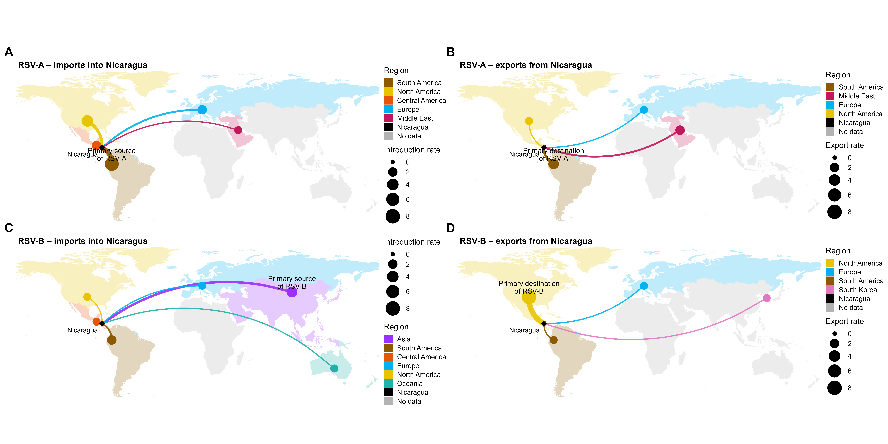

# RSV-A and RSV-B introductions to and exports from Nicaragua

World flow maps showing where RSV-A and RSV-B were **introduced into Nicaragua from** (imports) and where they were **exported to** (exports). Curve thickness and point size scale with the number of events per region.



*(Panels: A = RSV-A imports, B = RSV-A exports, C = RSV-B imports, D = RSV-B exports.)*

## Quick start

1. Install [R](https://cran.r-project.org/) (>= 4.1, for the `|>` pipe) and, optionally, [RStudio](https://posit.co/download/rstudio-desktop/).
2. Clone the repository:
   ```bash
   git clone https://github.com/Simon-Mufara/rsv-nicaragua-flow-maps.git
   cd rsv-nicaragua-flow-maps
   ```
3. Put the four input files in `data/` (see [`data/README.md`](data/README.md)).
4. Open the `.Rproj` in RStudio (or start R in the repo folder) and run:
   ```r
   source("R/nicaragua_rsv_transmission_maps.R")
   ```
   Missing packages are installed automatically on first run.

## Outputs

Written to `results/`:

| File | Description |
|---|---|
| `figures/map_RSVA_import.png/.pdf` | RSV-A introductions into Nicaragua |
| `figures/map_RSVA_export.png/.pdf` | RSV-A exports from Nicaragua |
| `figures/map_RSVB_import.png/.pdf` | RSV-B introductions into Nicaragua |
| `figures/map_RSVB_export.png/.pdf` | RSV-B exports from Nicaragua |
| `figures/Figure_RSV_Nicaragua_transmission.png/.pdf` | Combined four-panel figure (A-D) |
| `nicaragua_rsv_flow_rates_used.csv` | Tidy table of the counts plotted |

## Input format

Each Excel file is an **event list**: column 1 is an event number and one other column holds the region name. The region column is detected automatically from its content, and the rate for a region is the number of distinct events. Long (`From`/`To`/`Rate`) and matrix formats are also supported.

## Customising

Edit `region_info` near the top of the script to change a region's anchor point, colour or arc curvature. A region that appears in the data but not in `region_info` stops the script with a clear message telling you to add it.

## Repository layout

```
R/         analysis and plotting script
data/      input Excel files (see data/README.md)
results/   generated figures and flow-rate table
report/    written report
```

## Requirements

R packages: `here`, `readxl`, `dplyr`, `tidyr`, `tibble`, `ggplot2`, `sf`, `rnaturalearth`, `rnaturalearthdata`, `patchwork`. On Linux, `sf` needs system libraries (GDAL, GEOS, PROJ); see the [sf installation notes](https://r-spatial.github.io/sf/#installing).

## Citation

Mufara S. *RSV-A and RSV-B introductions to and exports from Nicaragua* (code repository). GitHub: Simon-Mufara. ORCID: 0000-0002-4430-2380.

## License

Code is released under the MIT License (see `LICENSE`). 
